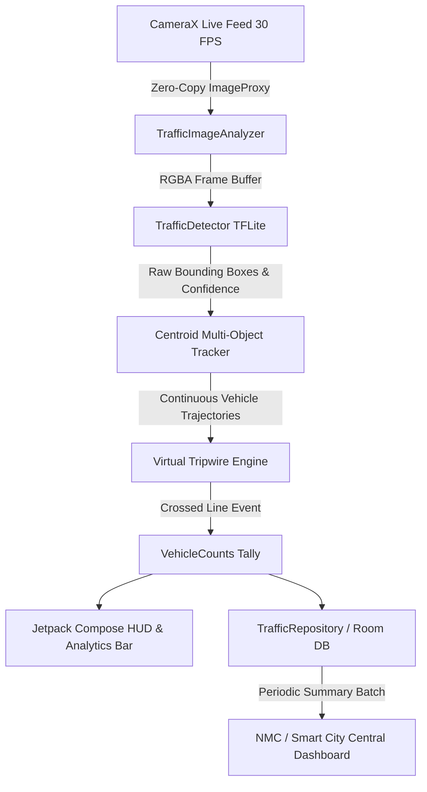

# TrafficIQ: Edge AI Traffic Monitoring System for Indian Cities

> **A smartphone-deployable, on-device computer vision system for real-time vehicle classification, counting, and congestion analytics without expensive CCTV infrastructure.**

[](https://trafficiq-edge-ai.vercel.app)
[](https://trafficiq-edge-ai.vercel.app)

🌐 **Live Production App URL:** **[https://trafficiq-edge-ai.vercel.app](https://trafficiq-edge-ai.vercel.app)**

---

## 1. Problem Statement & Motivation
Traffic monitoring in Tier-2 Indian cities (such as **Nagpur**) has historically relied on manual roadside counts or expensive, fixed CCTV + ANPR server infrastructure requiring continuous power, cabling, and dedicated maintenance contracts.

According to the **Ministry of Road Transport and Highways (MoRTH)** *"Road Accidents in India 2023"* report (released August 2025):
- India recorded **4,80,583 road accidents** in 2023 resulting in **1,72,890 deaths** (~55 accidents and 20 deaths every hour).
- **Two-wheeler riders account for 45% of all fatal accident victims**, making vehicle-mix monitoring and lane discipline critical public safety imperatives.
- Most urban roads lack continuous, data-driven traffic visibility for signal timing and road widening studies.

**TrafficIQ** solves this by converting a single mid-range smartphone (₹15,000–₹20,000) deployed on a tripod by a traffic police officer or Nagpur Municipal Corporation (NMC) field surveyor into an autonomous traffic monitoring station.

---

## 2. Core Capabilities
| Feature | Implementation | Benefit |
| :--- | :--- | :--- |
| **Live Vehicle Detection** | TensorFlow Lite (MobileNet / YOLO) | Bounding box on live camera stream |
| **Vehicle Classification** | 4 Target Indian Classes (`Bike`, `Car`, `Bus`, `Truck`) | Focuses on two-wheeler volume (45% fatality rate) |
| **De-duplicated Counting** | Centroid & IoU Multi-Object Tracker | Ensures 1:1 count as vehicles cross virtual tripwire |
| **Edge Offline Operation** | 100% on-device inference via NNAPI / GPU | Operates without cellular or WiFi connectivity |
| **Live Analytics Dashboard** | Jetpack Compose + Canvas HUD | Real-time vehicle-mix %, PCU load, flow rate (v/min), and FPS |
| **Periodic Data Sync** | Room SQLite + JSON / CSV telemetry export | Zero video uploaded (privacy-preserving); syncs summary counts to central control room |

---

## 3. System Architecture



### Key Technical Modules:
- **`ml/VehicleType.kt`**: Maps standard COCO classes to Indian municipal transport categories and assigns Passenger Car Unit (PCU) factors according to Indian Roads Congress (IRC) standards.
- **`ml/TrafficDetector.kt`**: Manages the TFLite runtime, thread pooling, NNAPI acceleration delegate, and includes an intelligent fallback traffic simulator for rapid UI preview and unit testing.
- **`ml/CentroidTracker.kt`**: Computes Euclidean distance associations across successive video frames, maintaining persistent `trackId`s and trajectory histories.
- **`ml/TripwireCounter.kt`**: Performs segment-intersection math between vehicle trajectory points and the configurable virtual tripwire, guaranteeing de-duplicated counting.
- **`camera/TrafficImageAnalyzer.kt`**: Connects the CameraX analysis pipeline to the detector on a background executor while measuring real-time FPS.
- **`ui/`**: Hardware-accelerated Jetpack Compose interface with dark tech aesthetic, bounding-box corner brackets, animated tripwire crossing pulses, and Nagpur chowk presets.

---

## 4. Pre-configured Nagpur Junctions
The app includes pre-calibrated configurations for high-density Nagpur junctions:
1. **Variety Square** (*Mahatma Gandhi Rd / Amravati Rd - Dharampeth Zone*)
2. **Sitabuldi Interchange** (*Wardha Rd / Central Ave - Dhantoli Zone*)
3. **Rahate Colony Chowk** (*Wardha Rd*)
4. **Medical Square** (*Medical College Rd / Ajni*)
5. **Zero Mile Square** (*Station Rd / Civil Lines*)
6. **Manewada Chowk** (*Outer Ring Road*)
7. **Sadar Residency Road** (*Mangalwari Zone*)
8. **RBI Square** (*Kingsway / Station Approach*)

Custom chowks and corridors can also be entered dynamically on-ground.

---

## 5. Building & Running the Project

### Prerequisites
- **Android Studio** (Koala / Ladybug or newer) OR **Android CLI**
- **Android SDK Platform 34+** (compileSdk 36, minSdk 24)
- **Java 17+**

### Method 1: Android Studio (Recommended)
1. Open Android Studio.
2. Select **Open** and choose the `TrafficIQ` folder (`c:\Users\Pawan Gupta\Downloads\TrafficIQ`).
3. Allow Gradle to sync dependencies.
4. Connect an Android phone (with USB debugging enabled) or start an Android Virtual Device (AVD).
5. Click **Run 'app'** (`Shift + F10`).
6. Grant camera permission on launch.

### Method 2: Command Line (Gradle)
```bash
cd TrafficIQ
./gradlew assembleDebug
```
The compiled APK will be generated at:
`app/build/outputs/apk/debug/app-debug.apk`

To install directly to a connected Android phone:
```bash
./gradlew installDebug
```

---

## 6. Model Customization & TFLite Swap
To add your own custom-trained model (e.g. YOLOv8-nano trained on Indian Traffic datasets):
1. Convert your model to `.tflite` format (quantized `INT8` or `FLOAT32`).
2. Place the model file in:
   `app/src/main/assets/ssd_mobilenet_v2_coco_quant.tflite` (or update `modelFileName` in `TrafficDetector.kt`).
3. Update `app/src/main/assets/coco_labels.txt` if using custom class IDs.

---

## 7. Cost Comparison

| Dimension | Fixed CCTV + ANPR Setup | TrafficIQ (Smartphone Edge AI) |
| :--- | :--- | :--- |
| **Capital Cost (Capex)** | High per-junction (₹2.5L – ₹8L per chowk) | Cost of 1 mid-range phone (₹15,000 – ₹20,000) |
| **Civil Works** | Trenching, pole erection, power cabling, UPS | None (portable tripod mount) |
| **Deployment Time** | 2 to 6 weeks per intersection | **< 3 minutes** (instant redeployment) |
| **Power Dependency** | Requires uninterrupted 240V AC or solar | Internal smartphone battery + power bank (8-10 hrs) |
| **Bandwidth Cost** | Continuous 1080p video stream upload | **Zero video upload** (only KB-sized count summaries) |
| **Citizen Privacy** | Continuous CCTV surveillance concerns | **Anonymous counting only**; no faces or plates stored |

---

## 8. License
Built for municipal and traffic engineering applications in Indian cities.
